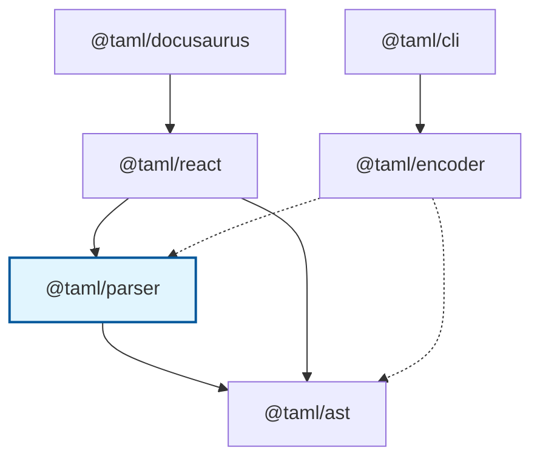

# @taml/parser

> Robust parser that converts TAML markup strings into typed AST nodes with comprehensive error handling and validation.

[](https://www.npmjs.com/package/@taml/parser)
[](https://www.npmjs.com/package/@taml/parser)
[](https://www.typescriptlang.org/)
[](https://opensource.org/licenses/MIT)
[](https://github.com/suin/taml-parser/actions/workflows/ci.yml)
[](https://github.com/suin/taml-parser/actions/workflows/publish.yml)

## TAML Ecosystem

**TAML (Terminal ANSI Markup Language)** is a lightweight markup language for styling terminal output with ANSI escape codes. For the complete specification, visit the [TAML Specification Repository](https://github.com/suin/taml-spec).

### Package Dependencies



### Related Packages

#### Core Infrastructure

- **[@taml/ast](https://github.com/suin/taml-ast)** - Foundation package providing AST node types, visitor patterns, and tree traversal utilities for TAML documents.
- **[@taml/parser](https://github.com/suin/taml-parser)** - Robust parser that converts TAML markup strings into typed AST nodes with comprehensive error handling and validation.

#### Input/Output Tools

- **[@taml/encoder](https://github.com/suin/taml-encoder)** - Converts raw ANSI escape sequences into clean TAML markup for further processing and manipulation.
- **[@taml/cli](https://github.com/suin/taml-cli)** - Command-line tool for converting ANSI escape sequences to TAML format in batch operations.

#### Integration Packages

- **[@taml/react](https://github.com/suin/taml-react)** - React component that renders TAML markup as styled JSX elements with full TypeScript support and performance optimization.
- **[@taml/docusaurus](https://github.com/suin/taml-docusaurus)** - Docusaurus theme that automatically detects and renders TAML code blocks in documentation sites.

## Installation

### npm

```bash
npm install @taml/parser
```

### yarn

```bash
yarn add @taml/parser
```

### pnpm

```bash
pnpm add @taml/parser
```

### bun

```bash
bun add @taml/parser
```

### TypeScript Setup

This package includes TypeScript declarations out of the box. No additional setup is required for TypeScript projects. The package automatically includes `@taml/ast` as a dependency for AST node types.

```typescript
// ESM
import { parseTaml, parseTamlSafe, validateTaml } from "@taml/parser";

// CommonJS
const { parseTaml, parseTamlSafe, validateTaml } = require("@taml/parser");
```

## Quick Start

Here's a 5-minute introduction to parsing TAML markup into structured AST trees:

```typescript
import { parseTaml, parseTamlSafe, validateTaml } from "@taml/parser";
import { getAllText, getElementsWithTag, visit } from "@taml/ast";

// Basic parsing
const ast = parseTaml("<red>Hello <bold>World</bold>!</red>");
console.log(getAllText(ast)); // "Hello World!"

// Safe parsing with error handling
const result = parseTamlSafe("<red>Hello <bold>World</bold></red>");
if (result.success) {
  console.log("Parsed successfully:", getAllText(result.ast));

  // Find specific elements
  const redElements = getElementsWithTag(result.ast, "red");
  const boldElements = getElementsWithTag(result.ast, "bold");

  console.log(`Found ${redElements.length} red elements`);
  console.log(`Found ${boldElements.length} bold elements`);
} else {
  console.error("Parse error:", result.error.message);
}

// Validation without full parsing
const validation = validateTaml("<green>Success!</green>");
if (validation.valid) {
  console.log("Valid TAML syntax");
} else {
  validation.errors.forEach((error) => console.error(error.message));
}

// Advanced usage with visitor pattern
visit(ast, {
  visitElement: (node) => {
    console.log(
      `Found ${node.tagName} element with ${node.children.length} children`,
    );
  },
  visitText: (node) => {
    console.log(`Text content: "${node.content}"`);
  },
});
```

## Core Concepts

### Parser Architecture

The TAML parser follows a multi-stage architecture for robust and efficient parsing:

#### 1. Tokenization

Converts raw TAML markup into a stream of typed tokens (open tags, close tags, text content).

#### 2. Validation

Validates token sequences against TAML specification rules and nesting requirements.

#### 3. AST Construction

Builds a typed Abstract Syntax Tree from validated tokens with proper parent-child relationships.

#### 4. Error Handling

Provides detailed error messages with line/column information for debugging.

### Supported TAML Features

The parser supports all 37 valid TAML tags from the specification:

#### Standard Colors

- **Foreground**: `black`, `red`, `green`, `yellow`, `blue`, `magenta`, `cyan`, `white`
- **Background**: `bgBlack`, `bgRed`, `bgGreen`, `bgYellow`, `bgBlue`, `bgMagenta`, `bgCyan`, `bgWhite`

#### Bright Colors

- **Foreground**: `brightBlack`, `brightRed`, `brightGreen`, `brightYellow`, `brightBlue`, `brightMagenta`, `brightCyan`, `brightWhite`
- **Background**: `bgBrightBlack`, `bgBrightRed`, `bgBrightGreen`, `bgBrightYellow`, `bgBrightBlue`, `bgBrightMagenta`, `bgBrightCyan`, `bgBrightWhite`

#### Text Styles

- **Formatting**: `bold`, `dim`, `italic`, `underline`, `strikethrough`

### Error Handling Approach

The parser uses a strict validation approach with comprehensive error reporting:

- **Position Tracking**: All errors include precise line and column information
- **Context Preservation**: Error messages show surrounding source code
- **Error Recovery**: Safe parsing functions allow graceful error handling
- **Detailed Messages**: Specific error types with actionable feedback

## Usage Examples

### Basic Parsing

#### Simple Color Tags

```typescript
import { parseTaml } from "@taml/parser";
import { getAllText } from "@taml/ast";

// Parse basic color formatting
const errorAst = parseTaml("<red>Error:</red> File not found");
console.log(getAllText(errorAst)); // "Error: File not found"

// Parse success message
const successAst = parseTaml("<green>✓</green> Operation completed");
console.log(getAllText(successAst)); // "✓ Operation completed"

// Parse warning with multiple styles
const warningAst = parseTaml(
  "<yellow><bold>Warning:</bold></yellow> Deprecated API",
);
console.log(getAllText(warningAst)); // "Warning: Deprecated API"
```

#### Text Formatting

```typescript
// Bold and italic text
const styledAst = parseTaml(
  "<bold>Important:</bold> <italic>Please read carefully</italic>",
);

// Underlined links
const linkAst = parseTaml(
  "Visit <underline>https://example.com</underline> for details",
);

// Strikethrough for deletions
const deletedAst = parseTaml(
  "Old: <strikethrough>deprecated method</strikethrough>",
);
```

### Complex Nesting

#### Nested Formatting

```typescript
// Complex nested structure
const complexAst = parseTaml(`
  <bold>
    <red>ERROR:</red>
    <underline>config.json</underline>:<yellow>line 42</yellow>
    <dim>(validation failed)</dim>
  </bold>
`);

// Log entry with multiple levels
const logAst = parseTaml(`
  <dim>2024-01-15 10:30:15</dim>
  <red>[ERROR]</red>
  <bold>Database connection failed</bold>
  <dim>
    Connection string: <underline>postgresql://localhost:5432/app</underline>
    Retry attempt: <yellow>3/5</yellow>
  </dim>
`);
```

#### Terminal Output Simulation

```typescript
// Git status output
const gitStatusAst = parseTaml(`
  On branch <green>main</green>
  Your branch is up to date with 'origin/main'.
  
  Changes not staged for commit:
    <red>modified:   src/app.ts</red>
    <red>modified:   README.md</red>
  
  Untracked files:
    <red>new-feature.ts</red>
`);

// Build output with progress
const buildAst = parseTaml(`
  <bold><blue>Building application...</blue></bold>
  
  <green>✓</green> TypeScript compilation <dim>(2.3s)</dim>
  <green>✓</green> Asset bundling <dim>(1.8s)</dim>
  <yellow>⚠</yellow> Bundle size: <bold>2.1MB</bold> <dim>(consider optimization)</dim>
  <green>✓</green> Build completed <dim>(4.1s total)</dim>
`);
```

### Error Recovery Patterns

#### Safe Parsing with Error Handling

```typescript
import { parseTamlSafe } from "@taml/parser";

const sources = [
  "<red>Valid content</red>",
  "<red>Unclosed content",
  "<red>Content</blue>",
  "<invalidTag>Invalid tag</invalidTag>",
  "<red>Nested <bold>content</red></bold>", // Mismatched nesting
];

sources.forEach((source, index) => {
  const result = parseTamlSafe(source);
  if (result.success) {
    console.log(`Source ${index}: Parsed successfully`);
    console.log(`Content: "${getAllText(result.ast)}"`);
  } else {
    console.log(`Source ${index}: ${result.error.message}`);

    // Handle specific error types
    if (result.error instanceof UnclosedTagError) {
      console.log(`  → Unclosed tag: ${result.error.tagName}`);
    } else if (result.error instanceof MismatchedTagError) {
      console.log(
        `  → Expected: ${result.error.expected}, Got: ${result.error.actual}`,
      );
    } else if (result.error instanceof InvalidTagError) {
      console.log(`  → Invalid tag: ${result.error.tagName}`);
    }
  }
});
```

#### Validation Before Parsing

```typescript
import { validateTaml, parseTaml } from "@taml/parser";

function safeParseWithValidation(source: string) {
  // First validate the syntax
  const validation = validateTaml(source);

  if (!validation.valid) {
    console.error("Validation failed:");
    validation.errors.forEach((error, index) => {
      console.error(`  ${index + 1}. ${error.message}`);
    });
    return null;
  }

  // If valid, parse safely
  return parseTaml(source);
}

// Usage
const ast = safeParseWithValidation("<red>Hello <bold>World</bold></red>");
if (ast) {
  console.log("Successfully parsed:", getAllText(ast));
}
```

### Real-World Use Cases

#### Log File Processing

```typescript
import { parseTaml, parseTamlSafe } from "@taml/parser";
import { visit, getElementsWithTag } from "@taml/ast";

// Process application logs with TAML formatting
function processLogEntry(tamlLog: string) {
  const result = parseTamlSafe(tamlLog);

  if (!result.success) {
    console.warn("Failed to parse log entry:", result.error.message);
    return null;
  }

  const ast = result.ast;

  // Extract log level
  const errorElements = getElementsWithTag(ast, "red");
  const warningElements = getElementsWithTag(ast, "yellow");
  const infoElements = getElementsWithTag(ast, "green");

  // Determine log level
  let level = "DEBUG";
  if (errorElements.length > 0) level = "ERROR";
  else if (warningElements.length > 0) level = "WARN";
  else if (infoElements.length > 0) level = "INFO";

  // Extract plain text content
  const message = getAllText(ast);

  return {
    level,
    message,
    hasFormatting:
      errorElements.length + warningElements.length + infoElements.length > 0,
    ast,
  };
}

// Example usage
const logEntries = [
  "<dim>2024-01-15 10:30:15</dim> <green>[INFO]</green> Server started",
  "<dim>2024-01-15 10:30:16</dim> <yellow>[WARN]</yellow> High memory usage",
  "<dim>2024-01-15 10:30:17</dim> <red>[ERROR]</red> Database connection failed",
];

logEntries.forEach((entry) => {
  const processed = processLogEntry(entry);
  if (processed) {
    console.log(`[${processed.level}] ${processed.message}`);
  }
});
```

#### Terminal Command Documentation

```typescript
// Parse command help output with TAML formatting
const commandHelp = parseTaml(`
  <bold>Usage:</bold> myapp <green>[command]</green> <yellow>[options]</yellow>
  
  <bold>Commands:</bold>
    <green>start</green>     Start the application
    <green>stop</green>      Stop the application
    <green>restart</green>   Restart the application
    <green>status</green>    Show application status
  
  <bold>Options:</bold>
    <yellow>--port</yellow>     <dim>Port number (default: 3000)</dim>
    <yellow>--env</yellow>      <dim>Environment (dev|prod)</dim>
    <yellow>--verbose</yellow>  <dim>Enable verbose logging</dim>
    <yellow>--help</yellow>     <dim>Show this help message</dim>
  
  <bold>Examples:</bold>
    <dim>myapp start --port 8080</dim>
    <dim>myapp status --verbose</dim>
`);

// Extract structured information
const commands: string[] = [];
const options: string[] = [];

visit(commandHelp, {
  visitElement: (node) => {
    if (node.tagName === "green") {
      const text = getAllText(node).trim();
      if (text && !commands.includes(text)) {
        commands.push(text);
      }
    } else if (node.tagName === "yellow") {
      const text = getAllText(node).trim();
      if (text.startsWith("--") && !options.includes(text)) {
        options.push(text);
      }
    }
  },
});

console.log("Available commands:", commands);
console.log("Available options:", options);
```

## Integration with TAML Ecosystem

### With AST Utilities

```typescript
import { parseTaml } from "@taml/parser";
import {
  visit,
  transform,
  getAllText,
  getElementsWithTag,
  findAll,
  createCollectorVisitor,
} from "@taml/ast";

const ast = parseTaml("<red>Error: <bold>File not found</bold></red>");

// Extract all text content
const plainText = getAllText(ast);
console.log(plainText); // "Error: File not found"

// Find specific elements
const redElements = getElementsWithTag(ast, "red");
const boldElements = getElementsWithTag(ast, "bold");

// Use visitor pattern for analysis
visit(ast, {
  visitElement: (node) => {
    console.log(`Found ${node.tagName} element`);
  },
  visitText: (node) => {
    console.log(`Text: "${node.content}"`);
  },
});

// Transform to different format
const html = transform(ast, {
  visitDocument: (node) =>
    node.children.map((child) => transform(child, this)).join(""),
  visitElement: (node) => {
    const content = node.children
      .map((child) => transform(child, this))
      .join("");
    return `<span class="taml-${node.tagName}">${content}</span>`;
  },
  visitText: (node) => node.content,
});

console.log(html); // '<span class="taml-red">Error: <span class="taml-bold">File not found</span></span>'
```

### With Encoder

```typescript
import { encode } from "@taml/encoder";
import { parseTaml } from "@taml/parser";
import { getAllText, visit } from "@taml/ast";

// Complete ANSI → TAML → AST pipeline
const ansiText = "\x1b[31mError:\x1b[0m \x1b[1mFile not found\x1b[0m";

// 1. Convert ANSI to TAML
const tamlMarkup = encode(ansiText);
console.log("TAML:", tamlMarkup); // "<red>Error:</red> <bold>File not found</bold>"

// 2. Parse TAML to AST
const ast = parseTaml(tamlMarkup);

// 3. Analyze the parsed content
const plainText = getAllText(ast);
console.log("Plain text:", plainText); // "Error: File not found"

// 4. Count formatting elements
let errorCount = 0;
let emphasisCount = 0;

visit(ast, {
  visitElement: (node) => {
    if (node.tagName === "red") errorCount++;
    if (node.tagName === "bold") emphasisCount++;
  },
});

console.log(
  `Found ${errorCount} error indicators, ${emphasisCount} emphasis elements`,
);
```

### With React Components

```typescript
import { parseTaml } from '@taml/parser';
import { TamlRenderer } from '@taml/react';

function LogViewer({ tamlContent }: { tamlContent: string }) {
  const ast = parseTaml(tamlContent);

  return (
    <div className="log-viewer">
      <TamlRenderer ast={ast} />
    </div>
  );
}

// Usage
const logEntry = '<dim>2024-01-15 10:30:15</dim> <red>[ERROR]</red> <bold>Connection failed</bold>';
<LogViewer tamlContent={logEntry} />
```

### With CLI Tools

```bash
# Convert ANSI to TAML, then parse and analyze
echo -e "\033[31mError:\033[0m \033[1mFailed\033[0m" | taml-cli | node -e "
  const { parseTaml } = require('@taml/parser');
  const { getAllText, getElementsWithTag } = require('@taml/ast');

  let input = '';
  process.stdin.on('data', chunk => input += chunk);
  process.stdin.on('end', () => {
    const ast = parseTaml(input.trim());
    const plainText = getAllText(ast);
    const errorElements = getElementsWithTag(ast, 'red');

    console.log('Plain text:', plainText);
    console.log('Error count:', errorElements.length);
  });
"
```

### Complete Processing Pipeline

```typescript
import { encode } from "@taml/encoder";
import { parseTaml, parseTamlSafe } from "@taml/parser";
import { visit, transform, getAllText, getElementsWithTag } from "@taml/ast";

// Complete ANSI → TAML → AST → Analysis → Output pipeline
class TamlProcessor {
  processAnsiOutput(ansiText: string) {
    // 1. Convert ANSI to TAML
    const tamlMarkup = encode(ansiText);

    // 2. Parse TAML to AST with error handling
    const parseResult = parseTamlSafe(tamlMarkup);

    if (!parseResult.success) {
      return {
        success: false,
        error: parseResult.error.message,
        originalText: ansiText,
      };
    }

    const ast = parseResult.ast;

    // 3. Extract information
    const plainText = getAllText(ast);
    const errorElements = getElementsWithTag(ast, "red");
    const warningElements = getElementsWithTag(ast, "yellow");
    const successElements = getElementsWithTag(ast, "green");

    // 4. Transform to different formats
    const html = transform(ast, {
      visitDocument: (node) =>
        `<div class="taml-output">${node.children.map((child) => transform(child, this)).join("")}</div>`,
      visitElement: (node) => {
        const content = node.children
          .map((child) => transform(child, this))
          .join("");
        return `<span class="taml-${node.tagName}">${content}</span>`;
      },
      visitText: (node) => this.escapeHtml(node.content),
    });

    // 5. Analyze content
    const analysis = {
      hasErrors: errorElements.length > 0,
      hasWarnings: warningElements.length > 0,
      hasSuccess: successElements.length > 0,
      elementCounts: {
        errors: errorElements.length,
        warnings: warningElements.length,
        success: successElements.length,
      },
    };

    return {
      success: true,
      originalAnsi: ansiText,
      tamlMarkup,
      plainText,
      html,
      analysis,
      ast,
    };
  }

  private escapeHtml(text: string): string {
    return text
      .replace(/&/g, "&amp;")
      .replace(/</g, "&lt;")
      .replace(/>/g, "&gt;")
      .replace(/"/g, "&quot;")
      .replace(/'/g, "&#39;");
  }
}

// Usage
const processor = new TamlProcessor();
const ansiOutput =
  "\x1b[31mERROR:\x1b[0m \x1b[1mDatabase connection failed\x1b[0m";
const result = processor.processAnsiOutput(ansiOutput);

if (result.success) {
  console.log("Plain text:", result.plainText);
  console.log("HTML:", result.html);
  console.log("Analysis:", result.analysis);
} else {
  console.error("Processing failed:", result.error);
}
```

## API Reference

### Main Functions

#### [`parseTaml(source, options?)`](ts/parser.ts)

Parses TAML source text and returns a DocumentNode AST.

```typescript
function parseTaml(source: string, options?: ParseOptions): DocumentNode;
```

**Parameters:**

- `source` - TAML source text to parse
- `options` - Optional parsing configuration

**Returns:** [`DocumentNode`](https://github.com/suin/taml-ast/blob/main/ts/nodes.ts) - Root AST node

**Throws:** Various error types for invalid syntax (see [Error Handling](#error-handling))

**Example:**

```typescript
const ast = parseTaml("<green>[SUCCESS]</green> Operation completed");
console.log(ast.children.length); // 2 (element + text)
```

#### [`parseTamlSafe(source, options?)`](ts/parser.ts)

Safe parsing that returns a result object instead of throwing errors.

```typescript
function parseTamlSafe(
  source: string,
  options?: ParseOptions,
): {
  success: boolean;
  ast?: DocumentNode;
  error?: Error;
};
```

**Example:**

```typescript
const result = parseTamlSafe("<red>Unclosed tag");
if (!result.success) {
  console.error("Parse failed:", result.error?.message);
} else {
  console.log("Parsed successfully:", getAllText(result.ast));
}
```

#### [`validateTaml(source)`](ts/parser.ts)

Validates TAML syntax without building the full AST.

```typescript
function validateTaml(source: string): {
  valid: boolean;
  errors: Error[];
};
```

**Example:**

```typescript
const { valid, errors } = validateTaml("<red>Hello</blue>");
if (!valid) {
  errors.forEach((error) => console.error(error.message));
}
```

### Parse Options

#### [`ParseOptions`](ts/parser.ts) Interface

```typescript
interface ParseOptions {
  /** Whether to include position information in nodes (default: true) */
  includePositions?: boolean;
  /** Maximum nesting depth to prevent stack overflow (default: 100) */
  maxDepth?: number;
}
```

**Examples:**

```typescript
// Parse without position information (smaller AST)
const ast = parseTaml("<red>Hello</red>", { includePositions: false });

// Parse with custom depth limit
const ast = parseTaml(deeplyNested, { maxDepth: 50 });
```

### Advanced Usage

#### [`TamlParser`](ts/parser.ts) Class

For advanced use cases, you can use the parser class directly:

```typescript
import { TamlParser } from "@taml/parser";

const parser = new TamlParser("<red>Hello World</red>");
const ast = parser.parse();

// Parse with options
const astWithOptions = parser.parseWithOptions({
  includePositions: true,
  maxDepth: 100,
});
```

#### Tokenization

Access the tokenization layer for advanced processing:

```typescript
import { tokenize, TamlTokenizer } from "@taml/parser";

// Quick tokenization
const tokens = tokenize("<red>Hello</red>");
console.log(tokens.length); // 4 tokens: open-tag, text, close-tag, eof

// Advanced tokenization with class
const tokenizer = new TamlTokenizer("<red>Hello</red>");
const tokens = tokenizer.tokenize();

// Inspect tokens
tokens.forEach((token) => {
  console.log(`${token.type}: ${token.value} at ${token.line}:${token.column}`);
});
```

#### Validation

Use the validator for detailed syntax checking:

```typescript
import { TamlValidator, validateTamlTokens } from "@taml/parser";

// Validate with class
const validator = new TamlValidator("<red>Hello</red>");
const tokens = tokenize("<red>Hello</red>");
const result = validator.validateTokens(tokens);

// Direct token validation
const validationResult = validateTamlTokens(tokens, "<red>Hello</red>");
console.log("Valid:", validationResult.valid);
console.log("Errors:", validationResult.errors);
```

### Error Handling

The parser uses a strict validation approach and throws detailed errors for any invalid syntax.

#### Error Types

##### [`TamlParseError`](ts/errors.ts)

Base class for all parsing errors with position information.

```typescript
class TamlParseError extends Error {
  constructor(
    message: string,
    public readonly position: number,
    public readonly line: number,
    public readonly column: number,
    public readonly source?: string
  )
}
```

##### [`InvalidTagError`](ts/errors.ts)

Thrown when an invalid tag name is encountered.

```typescript
// Throws InvalidTagError
parseTaml("<invalidTag>content</invalidTag>");
```

##### [`UnclosedTagError`](ts/errors.ts)

Thrown when a tag is not properly closed.

```typescript
// Throws UnclosedTagError
parseTaml("<red>unclosed content");
```

##### [`MismatchedTagError`](ts/errors.ts)

Thrown when closing tag doesn't match opening tag.

```typescript
// Throws MismatchedTagError
parseTaml("<red>content</blue>");
```

##### [`MalformedTagError`](ts/errors.ts)

Thrown when a tag is malformed (invalid syntax).

```typescript
// Throws MalformedTagError
parseTaml("<>empty tag name</>");
parseTaml("<red-invalid>hyphen in name</red-invalid>");
```

##### [`UnexpectedEndOfInputError`](ts/errors.ts)

Thrown when input ends unexpectedly.

##### [`UnexpectedCharacterError`](ts/errors.ts)

Thrown when an unexpected character is encountered.

#### Error Context

All errors include detailed context information:

```typescript
import {
  parseTaml,
  MismatchedTagError,
  UnclosedTagError,
  InvalidTagError,
} from "@taml/parser";

try {
  parseTaml("line1\n<red>line2\nline3</blue>");
} catch (error) {
  if (error instanceof MismatchedTagError) {
    console.log(`Error at line ${error.line}, column ${error.column}`);
    console.log(`Expected: ${error.expected}, Got: ${error.actual}`);
    console.log(error.getDetailedMessage()); // Shows source context
  } else if (error instanceof UnclosedTagError) {
    console.log(`Unclosed tag: ${error.tagName}`);
    console.log(error.getDetailedMessage());
  } else if (error instanceof InvalidTagError) {
    console.log(`Invalid tag: ${error.tagName}`);
    console.log(error.getDetailedMessage());
  }
}
```

#### Common Error Patterns

##### Invalid Tag Names

```typescript
// ❌ Invalid - not in TAML specification
parseTaml("<span>content</span>");
parseTaml("<custom>content</custom>");
parseTaml("<red-color>content</red-color>");

// ✅ Valid - TAML specification tags
parseTaml("<red>content</red>");
parseTaml("<bold>content</bold>");
parseTaml("<brightRed>content</brightRed>");
```

##### Nesting Issues

```typescript
// ❌ Invalid - mismatched tags
parseTaml("<red><bold>content</red></bold>");

// ❌ Invalid - unclosed tags
parseTaml("<red><bold>content</bold>");

// ❌ Invalid - extra closing tags
parseTaml("<red>content</red></bold>");

// ✅ Valid - proper nesting
parseTaml("<red><bold>content</bold></red>");
```

##### Malformed Syntax

```typescript
// ❌ Invalid - malformed tags
parseTaml("<red unclosed");
parseTaml("<123invalid>numeric start</123invalid>");
parseTaml("<red-dash>hyphens not allowed</red-dash>");
parseTaml("<>empty tag name</>");

// ✅ Valid - proper syntax
parseTaml("<red>content</red>");
parseTaml("<brightBlue>content</brightBlue>");
```

## Advanced Topics

### Performance Considerations

The parser is optimized for speed, memory efficiency, and detailed error reporting:

#### Optimization Features

- **Fast Tokenization**: Character-by-character streaming processing
- **Memory Efficient**: Minimal object allocation during parsing
- **Error Context**: Detailed error reporting without performance penalty
- **Depth Control**: Configurable nesting limits to prevent stack overflow

#### Benchmarks

Typical performance on modern hardware:

- **Simple tags**: ~500K operations/second
- **Complex nesting**: ~100K operations/second
- **Large documents**: ~5MB/second parsing speed
- **Memory usage**: ~150 bytes per AST node

#### Memory Usage

- **AST overhead**: ~100 bytes per node
- **Position tracking**: ~50 bytes per node (when enabled)
- **Parser state**: ~2KB base memory
- **Token overhead**: ~80 bytes per token

#### Optimization Tips

```typescript
// Disable position tracking for memory savings
const ast = parseTaml(source, { includePositions: false });

// Use validation for syntax checking without AST building
const { valid } = validateTaml(source);

// Use safe parsing to avoid exception overhead in batch processing
const result = parseTamlSafe(source);

// Set appropriate depth limits for deeply nested content
const ast = parseTaml(source, { maxDepth: 50 });
```

### Error Handling Patterns

#### Graceful Error Recovery

```typescript
import { parseTamlSafe, TamlParseError } from "@taml/parser";

function parseWithFallback(source: string, fallbackText?: string) {
  const result = parseTamlSafe(source);

  if (result.success) {
    return result.ast;
  }

  // Log error for debugging
  console.warn("TAML parse failed:", result.error.message);

  // Return fallback AST
  if (fallbackText) {
    return parseTaml(`<red>Parse Error:</red> ${fallbackText}`);
  }

  // Return minimal error AST
  return parseTaml("<red>Invalid TAML syntax</red>");
}
```

#### Batch Processing with Error Handling

```typescript
function parseBatch(sources: string[]): Array<{
  index: number;
  source: string;
  success: boolean;
  ast?: DocumentNode;
  error?: string;
}> {
  return sources.map((source, index) => {
    const result = parseTamlSafe(source);

    if (result.success) {
      return {
        index,
        source,
        success: true,
        ast: result.ast,
      };
    } else {
      return {
        index,
        source,
        success: false,
        error: result.error.message,
      };
    }
  });
}

// Usage
const sources = [
  "<red>Valid</red>",
  "<red>Invalid",
  "<green>Also valid</green>",
];

const results = parseBatch(sources);
const successful = results.filter((r) => r.success);
const failed = results.filter((r) => !r.success);

console.log(`Parsed ${successful.length}/${sources.length} successfully`);
failed.forEach((f) => console.error(`Failed ${f.index}: ${f.error}`));
```

#### Custom Error Handling

```typescript
import {
  TamlParseError,
  InvalidTagError,
  UnclosedTagError,
  MismatchedTagError,
} from "@taml/parser";

class TamlParseErrorHandler {
  handleError(
    error: Error,
    source: string,
  ): {
    type: string;
    message: string;
    suggestion?: string;
    position?: { line: number; column: number };
  } {
    if (!(error instanceof TamlParseError)) {
      return {
        type: "unknown",
        message: error.message,
      };
    }

    const baseInfo = {
      position: { line: error.line, column: error.column },
    };

    if (error instanceof InvalidTagError) {
      return {
        ...baseInfo,
        type: "invalid-tag",
        message: `Invalid tag '${error.tagName}'`,
        suggestion:
          "Use one of the 37 valid TAML tags (red, green, bold, etc.)",
      };
    }

    if (error instanceof UnclosedTagError) {
      return {
        ...baseInfo,
        type: "unclosed-tag",
        message: `Unclosed tag '${error.tagName}'`,
        suggestion: `Add closing tag: </${error.tagName}>`,
      };
    }

    if (error instanceof MismatchedTagError) {
      return {
        ...baseInfo,
        type: "mismatched-tag",
        message: `Expected '</${error.expected}>' but found '</${error.actual}>'`,
        suggestion: `Change closing tag to match opening tag`,
      };
    }

    return {
      ...baseInfo,
      type: "parse-error",
      message: error.message,
    };
  }
}

// Usage
const errorHandler = new TamlParseErrorHandler();

try {
  parseTaml("<red>unclosed");
} catch (error) {
  const handled = errorHandler.handleError(error, "<red>unclosed");
  console.error(`${handled.type}: ${handled.message}`);
  if (handled.suggestion) {
    console.log(`Suggestion: ${handled.suggestion}`);
  }
}
```

### Integration Patterns

#### Parser Factory Pattern

```typescript
class TamlParserFactory {
  private defaultOptions: Required<ParseOptions> = {
    includePositions: true,
    maxDepth: 100,
  };

  createParser(options?: Partial<ParseOptions>) {
    const opts = { ...this.defaultOptions, ...options };

    return {
      parse: (source: string) => parseTaml(source, opts),
      parseSafe: (source: string) => parseTamlSafe(source, opts),
      validate: (source: string) => validateTaml(source),
    };
  }

  createLightweightParser() {
    return this.createParser({
      includePositions: false,
      maxDepth: 50,
    });
  }

  createStrictParser() {
    return this.createParser({
      includePositions: true,
      maxDepth: 25,
    });
  }
}

// Usage
const factory = new TamlParserFactory();
const lightParser = factory.createLightweightParser();
const strictParser = factory.createStrictParser();

const ast1 = lightParser.parse("<red>Hello</red>");
const result = strictParser.parseSafe("<red>Hello</red>");
```

#### Streaming Parser for Large Documents

```typescript
class StreamingTamlParser {
  private buffer = "";
  private results: DocumentNode[] = [];

  processChunk(chunk: string): DocumentNode[] {
    this.buffer += chunk;
    const newResults: DocumentNode[] = [];

    // Try to parse complete TAML expressions
    const lines = this.buffer.split("\n");

    // Keep the last incomplete line in buffer
    this.buffer = lines.pop() || "";

    for (const line of lines) {
      if (line.trim()) {
        const result = parseTamlSafe(line.trim());
        if (result.success) {
          newResults.push(result.ast);
          this.results.push(result.ast);
        }
      }
    }

    return newResults;
  }

  finalize(): DocumentNode[] {
    // Process any remaining buffer content
    if (this.buffer.trim()) {
      const result = parseTamlSafe(this.buffer.trim());
      if (result.success) {
        this.results.push(result.ast);
      }
    }

    return this.results;
  }

  getAllResults(): DocumentNode[] {
    return [...this.results];
  }
}

// Usage
const streamParser = new StreamingTamlParser();

// Process chunks as they arrive
const chunk1 = "<red>Error:</red> Connection failed\n<green>Info:</green>";
const chunk2 =
  " Server restarted\n<yellow>Warning:</yellow> High memory usage\n";

const results1 = streamParser.processChunk(chunk1);
const results2 = streamParser.processChunk(chunk2);
const finalResults = streamParser.finalize();

console.log(`Processed ${finalResults.length} TAML expressions`);
```

#### Plugin Architecture

```typescript
interface TamlParserPlugin {
  name: string;
  beforeParse?(source: string): string;
  afterParse?(ast: DocumentNode): DocumentNode;
  onError?(error: Error, source: string): Error | null;
}

class ExtendedTamlParser {
  private plugins: TamlParserPlugin[] = [];

  addPlugin(plugin: TamlParserPlugin) {
    this.plugins.push(plugin);
    return this;
  }

  parse(source: string, options?: ParseOptions): DocumentNode {
    let processedSource = source;

    // Apply beforeParse plugins
    for (const plugin of this.plugins) {
      if (plugin.beforeParse) {
        processedSource = plugin.beforeParse(processedSource);
      }
    }

    try {
      let ast = parseTaml(processedSource, options);

      // Apply afterParse plugins
      for (const plugin of this.plugins) {
        if (plugin.afterParse) {
          ast = plugin.afterParse(ast);
        }
      }

      return ast;
    } catch (error) {
      // Apply error handling plugins
      for (const plugin of this.plugins) {
        if (plugin.onError) {
          const handledError = plugin.onError(error, source);
          if (handledError) {
            throw handledError;
          }
        }
      }
      throw error;
    }
  }
}

// Example plugins
const preprocessorPlugin: TamlParserPlugin = {
  name: "preprocessor",
  beforeParse: (source) => {
    // Convert legacy format
    return source.replace(/\[ERROR\]/g, "<red>[ERROR]</red>");
  },
};

const validationPlugin: TamlParserPlugin = {
  name: "validation",
  afterParse: (ast) => {
    // Add validation metadata
    const elementCount = getElementsWithTag(ast, "red").length;
    if (elementCount > 10) {
      console.warn("High number of error elements detected");
    }
    return ast;
  },
};

// Usage
const extendedParser = new ExtendedTamlParser()
  .addPlugin(preprocessorPlugin)
  .addPlugin(validationPlugin);

const ast = extendedParser.parse("[ERROR] Connection failed");
```

## Contributing

We welcome contributions! Please see our [Contributing Guide](CONTRIBUTING.md) for details.

### Development Setup

```bash
# Clone the repository
git clone https://github.com/suin/taml-parser.git
cd taml-parser

# Install dependencies
bun install

# Run tests
bun test

# Build the project
bun run build

# Lint and format
bun run lint
bun run format
```

### Testing

The project uses Bun for testing with comprehensive test coverage:

```bash
# Run all tests
bun test

# Run tests in watch mode
bun test --watch

# Run specific test files
bun test parser.test.ts
bun test tokenizer.test.ts
bun test validator.test.ts
bun test errors.test.ts

# Run with coverage
bun test --coverage
```

### Test Coverage

The parser is thoroughly tested with:

- **Unit Tests**: Core parsing functionality, tokenization, validation
- **Integration Tests**: End-to-end parsing scenarios with real-world examples
- **Error Handling**: All error types and edge cases
- **Performance Tests**: Memory usage and parsing speed benchmarks
- **Edge Cases**: Malformed input, deeply nested structures, large documents

### Code Quality Standards

```bash
# Type checking
bun run build

# Linting
bun run lint

# Code formatting
bun run format

# Run all quality checks
bun run build && bun run lint && bun test
```

### Adding New Features

When contributing new features:

1. **Add tests first** - Write comprehensive tests for new functionality
2. **Update documentation** - Include examples and API documentation
3. **Consider performance** - Ensure new features don't degrade parsing speed
4. **Maintain compatibility** - Follow semantic versioning for breaking changes
5. **Add error handling** - Provide clear error messages for invalid input

### Reporting Issues

When reporting bugs or requesting features:

- **Provide examples** - Include sample TAML input that demonstrates the issue
- **Include error messages** - Copy the full error message and stack trace
- **Specify environment** - Node.js version, operating system, package version
- **Expected behavior** - Describe what you expected to happen
- **Actual behavior** - Describe what actually happened

## License

MIT © [suin](https://github.com/suin)

---

**Part of the TAML ecosystem** - Visit the [TAML Specification](https://github.com/suin/taml-spec) for more information about the Terminal ANSI Markup Language.
